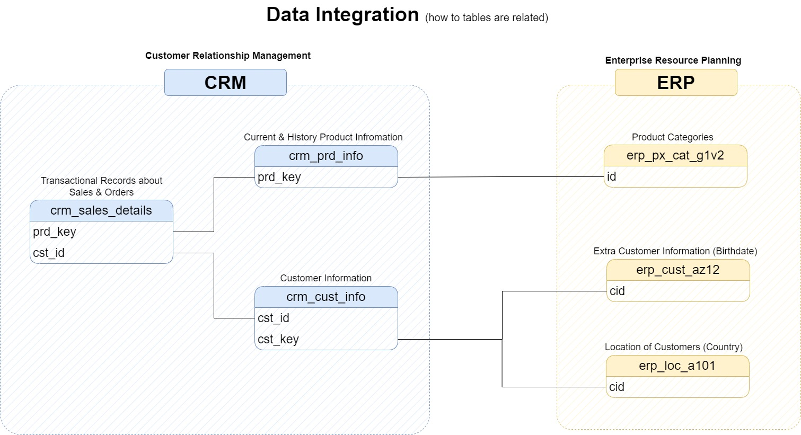

# Sales Data Warehouse Development Using SQL Server: An End-to-End ETL & Data Modeling Solution
_Building a modern data warehouse with SQL Server, including ETL processes, data modelling and analytics._

## 🔍 Overview
This repository contains a practical implementation of a Data Warehouse project designed to consolidate sales data from ERP and CRM systems, enabling analytical reporting and informed decision-making. Built using **SQL Server**, this project demonstrates skills in **Data Architecture Design, ETL Development, Data Modeling, and Documentation**. 

The project involves:

- Extracting and loading raw data using **SQL Server**.
- Processing and transforming data using **T-SQL (Transact-SQL)**.
- Storing cleaned and integrated data in a structured **Star Schema Model**.
- Automating ETL processes using **Stored Procedures**.
- Visualizing data using **Power BI**.
- Managing workflow and documentation using **Notion & Git**.

The data pipeline follows the Bronze, Silver, and Gold architecture pattern, ensuring data quality and consistency throughout the process.

---
## 🎯 Project Objectives
### Objective

The purpose of this project is to build a modern data warehouse using **SQL Server** to integrate sales data from various sources, enabling comprehensive analytical reporting and data-driven decision-making.

### Specifications

- **Data Sources:** Load data from two source systems: ERP (Enterprise Resource Planning) and CRM (Customer Relationship Management ) provided as CSV files.
- **Data Quality:** Ensure data accuracy and consistency by cleaning and addressing quality issues prior to analysis.
- **Integration:** Merge both sources into a cohesive, user-friendly data model, using a Star Schema, optimized for efficient analytical queries.
- **Scope:** Focus solely on the most recent dataset; data historization is not required.
- **Documentation:** Provide clear and thorough documentation of the data model to assist both business stakeholders and analytics teams.

---
## 📌 Features

- **Data Integration:** Combines multiple sources (ERP & CRM) into a unified data model.
- **ETL Pipeline:** Structured approach with Bronze, Silver, and Gold layers for data ingestion, cleaning, and modeling.
- **Data Modeling:** Star Schema with well-defined dimensions and facts.
- **Documentation:** Comprehensive explanations for each layer, including data flow diagrams and SQL scripts.

---
## 🏗️ Data Architecture
The data architecture of this project follows a Medallian three-layered approach (Bronze, Silver, Gold) to ensure efficient data processing, integration, and analytical reporting. The architecture is designed using SQL Server and structured to enhance data quality and accessibility.

**The data layers are described as follows:**

### **Bronze Layer (Raw Data Ingestion)**: 
  - Stores unprocessed data **as-in**, ingested directly from source systems (ERP & CRM) as CSV files.
  - The data is imported into a SQL Server Database with no transformation to maintain raw integrity.
### **Silver Layer(Data Integration & Cleansing)**:
  - Performs data cleansing, standardization, and normalization to enhance data quality and consistency.
  - Adds metadata columns (e.g dwh_created_date)
  - Ensures data is reliable, accurate, and ready for analytical modeling.
### **Gold Layer (Analytical Data Model)**:
  - Contains business-ready data structured into a Star Schema Model optimized for reporting and analytics.
  - Fact and dimension tables are created to support high-performance querying and efficient data retrieval.
  - Ready for visualization tools like Power BI to generate insightful reports.

---
## 📈 Entity-Relationship Diagram (ERD)

The tables from both ERP and CRM systems are linked together through common keys such as Customer IDs and Product IDs. The integration process ensures data consistency and accuracy before proceeding to the modeling phase.
The following diagram illustrates the relationships between the tables within the Data Warehouse:

---
## 📖 Workflow Breakdown

### Planning & Initialization

- Project Planning using **Notion**.
- Architecture design using **Draw.io**.
- Project initialization with naming conventions, Git repo setup, database & schema creation.

### 🥉 Bronze Layer (Raw Data Ingestion)

- Ingest data from raw files (ERP & CRM systems).
- Define tables using DDL scripts.
- Develop ETL scripts to import raw data into SQL Server.
- Document data flow.

### 🥈 Silver Layer (Data Cleaning & Transformation)

- Data Cleaning: Remove duplicates, handle missing values, standardize formats.
- Data Integration: Combine cleaned data from ERP & CRM sources.
- Load scripts & stored procedures to automate transformation processes.
- Document data flow & transformation logic.

### 🥇 Gold Layer (Analytical Data Model)

- Data Modeling: Create Star Schema with dimension & fact tables.
- Design analytical model to support business queries.
- Document data model design and provide sample queries.

## 💡 Technologies & Tools Used

- **SQL Server:** Data storage, ETL processes, data modeling.
- **Draw.io:** Architecture diagrams.
- **Notion:** Project planning & task management.
- **Git & GitHub:** Version control & documentation.

---
## About me

Hi, I'm Wassima Manssour, a data analyst and PhD student focusing on AI applications in healthcare, specifically in neurodegenerative diseases. With a passion for data science, I work on projects that explore the intersection of machine learning, deep learning, and healthcare. I also run Wassima Academy, where I share educational resources on data science and AI to help students in their academic journeys

Feel free to check out my work, and thank you for exploring this project!
I'd love to stay in touch! You can connect with me on the following platforms:

---
Special thanks to Baraa (https://datawithbaraa.substack.com/) for the extensive explanations and insights that greatly contributed to the completion of this end-to-end data warehouse project.
