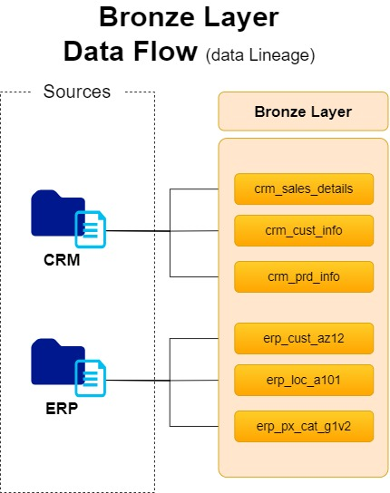

# Bronze Layer (Raw Data Storage)
The Bronze Layer focuses on ingesting raw data from the source systems (ERP & CRM) and loading it into the Data Warehouse without applying any transformations. The goal is to store the data as-is to ensure data integrity and traceability.

## 📌 Technical Details

- **Extraction Type:** Full Extraction
    - Data is fully extracted from the source systems as CSV files without incremental logic.
    - The extraction process relies on file parsing to read and structure the incoming data.
- **Load Method:** Pull-based Load (Truncate & Insert)
    - The existing tables are truncated before each new load to ensure a complete refresh of the data.
    - Data is inserted into the SQL Server Database using efficient bulk insert operations.
- **Purpose:**
  - Maintain a faithful copy of the raw data for traceability and reproducibility.
  - Ensure compatibility with the Silver Layer for subsequent processing and integration.

## 📁 Files

- **1__ddl_bronze_layer.sql:** Contains table definitions for storing raw data. This script creates the necessary tables to mirror the structure of the incoming CSV files from the ERP and CRM systems.
- **2__load_bronze_tables.sql:** Scripts for loading data from CSV files into SQL Server. It handles the **Truncate & Insert** approach, ensuring fresh data is ingested during each load cycle.
- **3__stored_procedure_load_bronze.sql:** Defines a stored procedure responsible for automating the data loading process. This procedure performs bulk inserts after truncating the target tables, streamlining the ingestion process.
- **BronzeLayer.md (This file):** Layer-specific documentation.

## Data Flow

