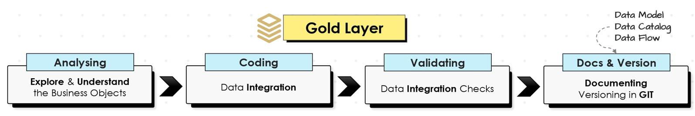

# Gold Layer (Data Modeling & Aggregation)
The Gold Layer is the final layer of the Data Warehouse, designed to support analytical reporting and data visualization. It involves building a Star Schema to facilitate efficient querying and reporting for decision-making purpose.

## 📌 Technical Details

**Star Schema Design:**
    - **Fact Table:** Contains measurable data (`Fact_Sales`) with keys referencing related dimension tables.
    - **Dimension Tables:** Represent descriptive data (`Dim_Customers`, `Dim_Products`).
 **Adding Keys:**
    - Surrogate keys are used as the primary key for each dimension table.
    - Foreign keys are used to link dimension tables with the fact table.
**Creating Views:**
    - Predefined views are created to simplify data access for BI tools and analysts.
    - Example: `vw_SalesAnalysis` combines `Fact_Sales` with dimensions for reporting.
  
 ## 📁 Files

**1__join_tablesgold_layer.sql:** Joins and aggregates data to define fact and dimension tables according to the Star Schema Model.
**2__ddl_views_for_gold_layer.sql:** Defines the DDL views for the gold layer, creating structured views for easy access to aggregated and transformed data.

## Data Flow

