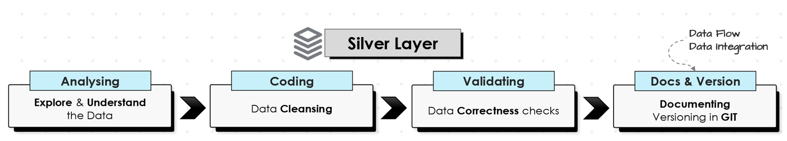

# Silver Layer (Data Cleaning & Transformation)
The Silver Layer focuses on transforming raw data from the Bronze Layer to ensure data quality, consistency, and usability for analytical purposes. This process involves data cleansing, normalization, enrichment, and standardization.

## 📌 Technical Details

- **Data Cleansing:**
    - Removing duplicates.
    - Handling missing values by either **imputation** or **deletion**.
    - Resolving data type mismatches.
- **Standardization & Normalization:**
    - Converting data formats (e.g., date formats).
    - Standardizing text fields (e.g., casing, removing special characters o rempty spaces).
- **Data Enrichment:**
    - Adding new attributes from calculations (e.g., `Total_Sales = Quantity * Unit_Price`).

## 📁 Files

- **00__Explore_bronze_layerdata.sql:** Explore the raw data structure to identify inconsistencies and potential issues for further investigation.
- **00__ddl_silver_layer.sql:** Defines tables for the cleaned and standardized data in the Silver Layer.
- **1__check_data_from_bronze_layer.sql:** Perform checks across various tables and columns to identify problems such as inconsistent categories, missing values, and duplicates that need to be addressed during the transformation process.
- **2__data_transformations.sql:** Transformation scripts that address the anomalies identified in "1__check_data_from_bronze_layer.sql" to clean and standardize the data.
- **3__data_transformations_load_to_silver_layer.sql:** Contains transformation scripts for loading the cleaned and standardized data from the Bronze Layer into the Silver Layer.
- **5__stored_procedure_load_silver.sql:** A stored procedure that automates data cleansing, enrichment, and loading tasks for the Silver Layer.
- **SilverLayer.md (This file):** Documentation providing details and context for the Silver Layer process and structure.

## Data Flow

